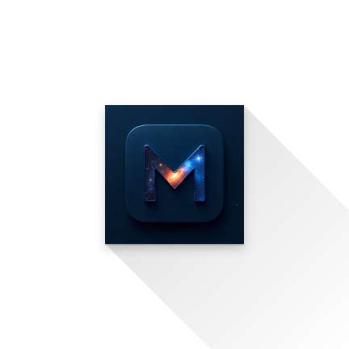

# 🎬 MovieVerse

<div align="center">
  
  
  <h3>A Modern Movie Discovery Experience</h3>
  
  [](https://flutter.dev)
  [](https://dart.dev)
  [](https://opensource.org/licenses/MIT)
  
  
  
</div>

---

## ✨ Features

### 🎯 Core Features
- **🔥 Trending Movies**: Discover what's hot right now
- **🔍 Advanced Search**: Search by title, genre, year, and rating
- **⭐ Personal Ratings**: Rate movies and build your taste profile
- **💖 Favorites**: Create and manage your personal watchlist
- **🎨 Beautiful UI**: Modern, dark-themed interface with smooth animations
- **📱 Responsive Design**: Optimized for all screen sizes

### 🤖 Smart Features
- **🎯 Personalized Recommendations**: AI-powered suggestions based on your preferences
- **🎪 Interactive Trailers**: Watch movie trailers directly in the app
- **📊 Detailed Movie Info**: Comprehensive movie details, cast, and crew information
- **🔄 Real-time Updates**: Fresh content from TMDB API
- **💾 Offline Favorites**: Access your favorites even without internet

### 🎪 User Experience
- **⚡ Fast Performance**: Optimized for speed with image caching
- **🌟 Smooth Animations**: Fluid transitions and micro-interactions
- **🎭 Hero Animations**: Seamless navigation between screens
- **📱 Material Design 3**: Following latest Android design guidelines

---

## 🚀 Getting Started

### Prerequisites

Before running MovieVerse, make sure you have:

- **Flutter SDK** (3.10.0 or higher)
- **Dart SDK** (3.0.0 or higher)
- **Android Studio** / **VS Code** with Flutter extensions
- **Git** for version control

### 🔑 API Setup

1. Get your free API key from [The Movie Database (TMDB)](https://www.themoviedb.org/documentation/api)
2. Create a `.env` file in the project root:
   ```env
   TMDB_API_KEY=your_api_key_here
   TMDB_BASE_URL=https://api.themoviedb.org/3
   TMDB_IMAGE_BASE_URL=https://image.tmdb.org/t/p/w500
   ```

### 📦 Installation

1. **Clone the repository**
   ```bash
   git clone https://github.com/yourusername/movieverse.git
   cd movieverse
   ```

2. **Install dependencies**
   ```bash
   flutter pub get
   ```

3. **Run the app**
   ```bash
   flutter run
   ```

---

## 🏗️ Architecture

MovieVerse follows a clean, scalable architecture:

```
lib/
├── core/                    # Core functionality
│   ├── cache/              # Caching utilities
│   ├── config/             # App configuration
│   ├── constants/          # App constants & themes
│   └── database/           # Local database
├── data/                   # Data layer
│   └── models/            # Data models & API services
│       └── datasources/   # External data sources
└── presentation/          # UI layer
    ├── providers/         # State management (Provider)
    ├── screens/          # App screens
    └── widgets/          # Reusable UI components
```

### 🔧 Key Technologies

- **State Management**: Provider pattern for reactive state management
- **HTTP Client**: HTTP package for efficient API calls
- **Local Storage**: SQLite for favorites and user data
- **Image Caching**: Advanced image caching for optimal performance
- **Navigation**: GoRouter for declarative navigation
- **Architecture**: Clean Architecture with clear separation of concerns

---

## 🎨 Design System

### Color Palette
```dart
// Primary Colors
- Primary: #1E88E5 (Blue)
- Secondary: #FFC107 (Amber)
- Background: #0D1117 (Dark)
- Surface: #161B22 (Dark Grey)

// Accent Colors
- Success: #28A745
- Warning: #FD7E14
- Error: #DC3545
- Info: #17A2B8
```

### Typography
- **Headlines**: Roboto Bold
- **Body Text**: Roboto Regular
- **Captions**: Roboto Light

---

## 🤝 Contributing

We love contributions! Here's how you can help make MovieVerse better:

### 🐛 Bug Reports
1. Check existing issues first
2. Create a detailed bug report with steps to reproduce
3. Include screenshots if applicable

### ✨ Feature Requests
1. Search existing feature requests
2. Create a detailed proposal with use cases
3. Discuss implementation approaches

### 💻 Code Contributions
1. **Fork** the repository
2. **Create** a feature branch: `git checkout -b feature/amazing-feature`
3. **Commit** your changes: `git commit -m 'Add amazing feature'`
4. **Push** to branch: `git push origin feature/amazing-feature`
5. **Open** a Pull Request

### 📝 Development Guidelines
- Follow [Flutter style guide](https://github.com/flutter/flutter/wiki/Style-guide-for-Flutter-repo)
- Write descriptive commit messages
- Add comments for complex logic
- Update documentation as needed

---

## 📱 Supported Platforms

- ✅ **Android** (5.0+, API level 21+)
- ✅ **iOS** (13.0+)
- 🔄 **Web** (Coming Soon)
- 🔄 **Desktop** (Coming Soon)

---

## 🚀 Upcoming Features

- [ ] **User Accounts**: Sync data across devices
- [ ] **Watch Parties**: Watch movies together with friends
- [ ] **Movie Reviews**: Read and write detailed reviews
- [ ] **Streaming Info**: Find where to watch movies
- [ ] **AR Features**: Movie poster recognition
- [ ] **Dark/Light Theme Toggle**: User preference themes

---

## 📄 License

This project is licensed under the MIT License - see the [LICENSE](LICENSE) file for details.

---

## 🙏 Acknowledgments

- **[TMDB](https://www.themoviedb.org/)** - For providing the movie database API
- **[Flutter Team](https://flutter.dev/community)** - For the amazing framework
- **[Material Design](https://material.io/)** - For design inspiration
- **Open Source Community** - For various packages and tools used

---

<div align="center">
  <h3>⭐ Don't forget to star this repository if you found it helpful! ⭐</h3>
  
  <p>Made with ❤️ by the MovieVerse Team</p>
  
  <p>
    <a href="#-movieverse">Back to Top ⬆️</a>
  </p>
</div>
